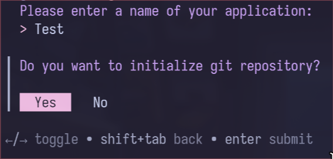

# TUIGoInit

TUIGoInit is a TUI tool designed to quickly initialize a Text-based User Interface (TUI) project blueprint in Go.



# Installation

TUIGoInit can be installed via `go install`:
```bash
go install github.com/AYGA2K/TUIGoInit@latest
```

